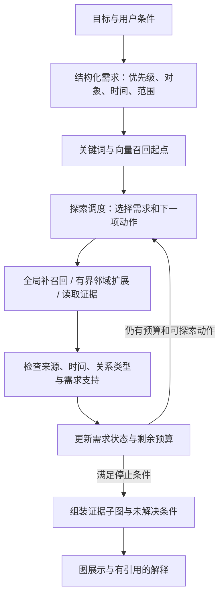

# 面向目标的多方面图检索：研究框架 v0.1

2026-09-30 · Eva Ng · 研究设计草案；方法尚未实现或评测，不是新颖性结论。

## 1. 要解决的具体问题

输入不是只有一个关键词，而是一个有多个条件的目标。例如：

> 我要做面向中小企业的 AI 安全产品，需要有 agent security 实作经验的人、了解企业采购的人，以及可以探索试点的渠道。

输出应包含互补的人或资源、每项推荐的具体证据、可能的联系路径，以及目前没有足够证据的条件。不能把很多相似的技术联系人当作完整答案，也不能把同公司、共同项目、被提到过自动升级为熟人或可靠介绍人。

研究问题：**在相同证据规则和资源上限下，根据已取得的证据更新需求状态并重新分配探索预算，何时能改善多方面支持覆盖，何时不如简单方法划算？**

第一版限于候选资源发现与证据子图检索。不会证明某人愿意参与、实际可用、团队一定能成功，或网络中不存在某类人。战略可行性、团队排期与最终商业决策不包含在这个检索问题内。

## 2. 已有研究及边界

| 研究 | 已经做到的相关机制 | 我们应借鉴或对照什么 |
|---|---|---|
| [xQuAD，ECIR 2010](https://terrierteam.dcs.gla.ac.uk/publications/ecir2010_rodrygo_div.pdf) | 逐步选择结果时更新方面覆盖，鼓励新的方面 | 固定候选集上的多样化基线；残余覆盖不是新概念 |
| [Lappas et al.，KDD 2009](https://cs-people.bu.edu/evimaria/cs591/lappas09finding.pdf) | 社交网络内技能覆盖与连接成本的团队选择 | 新增覆盖/连接成本贪心基线；组互补团队不是新概念 |
| [G-Retriever，2024](https://arxiv.org/abs/2402.07630) | 用 Prize-Collecting Steiner Tree 选择与问题相关的子图 | 证据子图组装及成本取舍；不能把返回子图当作创新 |
| [ToG-2，v7](https://arxiv.org/html/2407.10805v7) | 交替检索图和文本，判断知识是否充分并生成缺失证据线索 | 不仅是固定 hop；应考虑有反馈的检索对照 |
| [HippoRAG 2，2025](https://arxiv.org/abs/2502.14802) | 结合检索、过滤与 Personalized PageRank 进行关联检索 | 图传播基线，不必每条边都调用模型 |
| [CatRAG，v1，2026](https://arxiv.org/html/2602.01965v1) | 查询相关的种子出边权重及 passage 权重调整，然后执行 PPR | 一次性查询加权基线；动态边权不是我们的独创 |
| [ARK，2026](https://arxiv.org/abs/2601.13969) | agent 在全局搜索和局部邻域探索之间自适应切换 | 最接近的通用探索对照之一 |
| [GraphSearch，2025](https://arxiv.org/abs/2509.22009) | 图/文本双通道检索及迭代证据检查 | 缺口反馈与多轮搜索也已有先例 |
| [AdaKG-RAG，2026](https://link.springer.com/article/10.1007/s44443-026-01028-3) | 假设与验证循环检查证据是否充分，并定向寻找桥接事实 | 直接限制“发现缺口再检索”的新颖性；其论文也有预算匹配实验 |

以上是机制对照，不是宣称这些论文都解决了专业人脉战略检索。应用不同也不能自动证明算法不同。另有 [ToPG 官方实现](https://github.com/idiap/ToPG) 提供 proposition graph、分解、迭代检索及覆盖/预算跟踪，值得作为实现参考；本次没有完整复现它。

**更窄的候选研究定位**：对多条件专业网络查询，将明确的需求状态、证据绑定与有限探索预算放在同一套可审计调度策略中，测量其质量—成本曲线。它可能形成方法改进，也可能更适合做系统/实验研究。现在不能写“首次”“新算法”或“优于现有方法”。

相关论文说明研究活跃，不能据此断言市场需求增长率。更详细的相近工作核查见 [研究笔记](../../research/research_notes/2026-09-30-adaptive-search-related-work.md)。

## 3. 三条路线与建议

| 路线 | 优点 | 局限 |
|---|---|---|
| Hybrid recall + 固定扩展 + 多样化重排 | 易实现，能建立可靠基线，成本容易控制 | 没进入候选池的桥接证据仍可能漏掉 |
| 通用 LLM agent 自主选择图/文本工具 | 灵活，有成熟相近工作可参考 | 每轮推理的延迟、成本和不稳定性需要计入 |
| 显式需求状态驱动的有界探索 | 策略透明，可单独检验预算分配的效果 | 需要定义证据支持和探索规则，未必比前两种更好 |

建议把第一条作为工程底座，第三条作为实验方法，第二条作为强对照。三者共用图、索引、证据资格与最终组装接口，避免用不同数据质量制造方法差距。

## 4. 框架与数据流



底层图是人、项目、组织和带来源的断言。能力、行业经验、商业需求、资源渠道可以是断言的 facet，不要求立刻全部变成新节点。只有具备独立身份和明确关系的数据才需要实体化。

“项目→能力→战略”不是固定的三级索引。项目和能力可能提供证据；战略通常是此次查询的目标与约束。相同事实可以服务不同目标，但搜索不能因此修改事实或凭空生成关系。

HNSW 可以服务向量起点召回，不能把它的随机稀疏层直接解释为语义层，也不能继承其性能结论。[HNSW 原论文](https://arxiv.org/abs/1603.09320)

### 输入和输出契约

| 对象 | 最小内容 |
|---|---|
| QuerySpec | query_id；需求列表；require/prefer/exclude；用户明说或系统建议；主体绑定；时间和范围 |
| GraphView | snapshot_id；可读实体/断言/来源；统一资格过滤；可分页邻接查询 |
| SearchState | 已读证据；每项需求状态；候选动作；已执行动作；剩余预算；路径与联系语义 |
| RetrievalResult | 候选实体；需求到断言到来源的映射；路径；缺口状态；停止原因；实际开销和轨迹 |

原型先使用人工确认的结构化需求。所有方法取得相同输入。之后再接 LLM 解析自然语言，单独测解析错误，不能把更好的 query decomposition 算成搜索策略改进。

需求必须保留对象绑定：“一个同时懂安全与采购的人”与“团队里分别有安全和采购资源”不同。只有后一种允许不同人分别覆盖条件。公司有需求也不能据此认定发消息的联系人有该项技能。

### 证据状态

至少区分 `unsearched`、`candidate_match`、`supported`、`conflicted`、`not_found_within_budget`、`budget_omitted`。

- 向量相似、关键词命中只是 candidate_match。
- supported 必须满足预先写明的谓词、主体绑定、时间/范围条件，并保留来源；图中“confirmed”并不自动证明它支持所有相关查询。
- 例：仅参与安全项目不能满足“负责安全测试交付”；有明确职责/交付断言才可能满足。
- exclude 为约束，不能计入正向覆盖。没有负面证据不等于排除条件已通过；尚不能确认时标记未知。
- 初版运行时用公开给所有方法的结构化断言与规则判断；不访问测试 gold。开放文本的语义支持判断留作后续独立评测的模块。
- 原始数据缺失与预算内未检出不同。不能由一次检索断言“你缺少这种人”。

## 5. 可检验的探索机制

把一次动作定义为对某需求执行全局补召回、读取某类邻接分页，或回填某候选的来源证据。路径可以跨类型，但每一步必须有真实关系支持。

对每个正向需求 i，维护证据支持程度 c_i；第一版采用满足全部条件才为 1，否则为 0。部分命中保留为候选，不提前消除需求。残余需求 r_i = 1 - c_i，优先级权重 w_i 来自用户条件。

候选动作 a 的研究用优先分数可写成：

`priority(a) = [sum_i w_i * r_i * estimated_support_gain(a, i) + bridge_bonus(a)] / estimated_cost(a)`

这是待测启发式，不是已证明最优的算法：

1. estimated_support_gain 只使用已经可见的实体描述、关系类型和索引信号；不是 gold label，也不能偷看尚未付费读取的邻域。
2. 关键词/向量分数可用于这个估计，但实际 coverage 只在读到支持证据后更新。分数需在开发集归一化，不能直接混加不同量纲。
3. bridge_bonus 给暂时不能直接覆盖需求的桥接动作保留探索机会。用开发集确定有界探索配额，并消融为零；任何 lookahead 读取都计入开销。
4. 类型约束表示合法证据路径，不预设“项目必然比公司强”。四层关系语义继续分开，不能统统变成熟悉度分数。
5. 排除重复动作，但不能只按节点全局 visited：同一个人可有不同角色或支持路径。按节点、需求、路径语义保留有界候选；相同状态且无新增证据的更昂贵路径可丢弃。
6. 没有可用局部路径时可以全局补召回，避免初始种子遗漏永久限制探索范围。补召回仍计入同一预算。

```text
读取统一的图快照和 QuerySpec
取得初始候选，计入预算
初始化证据、需求状态与动作队列
while 尚有预算且有合法动作:
    根据当前残余需求重新排列动作
    执行动作，记录实际开销
    校验取得的断言与来源，更新需求状态
    加入有界的新动作，淘汰重复或被支配的状态
    若所有必需条件有支持且本次目标已满足，停止
返回证据完整的结果，标注其他条件与停止原因
```

可选偏好有单独预设的预算份额，不能使已经满足的简单查询无休止探索。达到预算、无动作可执行或目标满足都可以停止，不能把其中任何一种包装成全网搜索穷尽。

组装结果允许是多个带证据的连通分量。找不到可靠联系路径的人可以作为待探索线索，不能为画出漂亮的连通图补一条虚假边。若输出字节/实体限制移除了支持证据，最终覆盖必须基于实际输出重新计算，并标注 budget_omitted。

## 6. 与当前 demo 的接缝

已核对 [retrieval.py](../../../adapters/network/retrieval.py) 与 [agent.py](../../../adapters/network/agent.py)：

- 当前 `people()` 使用文本 token 匹配并扫描人及关联记录；尚不是 BM25 + 向量索引。
- `neighborhood()` 使用有界 BFS，分别保留人与人路径及上下文路径。
- `pack()` 已经优先选择新增需求命中的证据包，且有来源和体积限制。但其 coverage 是文本匹配，不是语义证明。
- agent 已有需求分解、工具检索、补充遗漏词检索与回答合成；不需要重写所有产品功能。

拟新增的是可替换的搜索策略与统一计量接口。原有方法保留为基线；证据资格规则从现有模型复用。索引读取、邻域读取、证据读取通过 GraphView 接口隔离，数据库用 PostgreSQL 或图存储不应改变研究定义。

第一步从冻结的合成快照运行实验，不迁移生产数据库，不把正在更新的 inbox 混入可重复实验。生产集成随后再考虑图版本、索引水位、缓存失效和增量重算。

## 7. 速度设计：让模型做少量语义工作

线上目标是一次需求解析，结构化调度与索引检索完成主要探索，最后一次解释合成；需要额外验证的开放文本单独计量。这个调用形态是设计目标，不是已经实现的延迟保证。

- BM25/向量候选召回、类型/时间过滤与有界邻接分页；避免每次把全网 catalog 发给模型。
- 批量回填来源，限制高 degree 节点的单次展开，记录截断与可继续分页状态。
- 缓存必须包含图快照、权限/审核策略、时间窗口与查询规范；不能跨更新复用过期证据。
- 检索质量与耗时画曲线，不只比较单一预算点。已有 PostgreSQL/Neo4j 存储实验不能替代端到端策略测试。

## 8. 最小评测与推进顺序

先建立三类案例：多个互补条件、需要桥接证据、证据不足/冲突。随后加入简单单条件、同名人、时间失效、共享公司误关联、高 degree 干扰及同人多条件约束。简单查询也是重要对照，不能只设计对复杂方法有利的问题。

第一轮用约 12 个手工诊断场景检查机制与失败原因；这不是统计显著性实验。正式测试规模依据试跑方差与导师反馈确定，在测试前冻结图、查询、标注规则与预算。按场景/模板分组隔离开发测试，不让同模板改名字的案例泄漏。

所有基线共享 query aspects、证据过滤、底层信息和输出限制：

1. Hybrid recall + 固定有界扩展 + 公共证据组装。
2. 相同候选池 + xQuAD-style 重排；明确实际采用的变体。
3. 覆盖/连接成本贪心选择；说明对断言证据的适配。
4. 一次性 query-conditioned 权重/PPR；若只是简化实现，不能称完整 CatRAG 复现。
5. 至少一个有缺口反馈的 agentic 检索强对照，优先评估 ARK/ToG-2/AdaKG-RAG 中适合本任务的适配。只赢静态方法不能证明有新的自适应机制。
6. 实验策略消融：不更新残余需求；仅最终重排；不给桥接动作配额。证据资格约束对所有主方法相同。

G-Retriever 的 PCST 可作为第二阶段子图组装比较，不必一开始复现其全部训练与生成流程。固定候选池的覆盖上限可作诊断，不能在不计候选构建成本时当作公平在线基线。

主指标：最终输出中有支持的必需条件覆盖率、满足全部必需条件的查询比例、推荐断言精确率、完整有效证据路径比例，以及将未知误报为已满足/不存在的频率。分别报告“检索到了但输出丢了”和“根本未检出”。不把信息不足的查询强行记为应有完整答案。

费用是向量：关系/记录读取量、数据库执行时间、实际上下文大小、模型调用和 tokens、端到端 P50/P95。不能把一次读十万条的调用与一次读十条的调用都按一个单位宣称等预算。固定硬上限并报告实际消耗；预计算/index 构建成本及冷/热缓存分别记录。

支持判断 gold 与运行时规则分开，由独立标注审核；真实资料案例先取得合适授权并去标识。合成数据只支持机制可行性，不替代工业有效性。公开基准是否适配、能否形成可分享的数据集，待导师确定论文范围。

推进顺序：读透最接近方法 → 冻结 QuerySpec/证据规则与案例 → 跑简单基线 → 加探索策略和强对照 → 画质量/成本曲线 → 决定贡献表述。若收益只来自更好的抽取或更多预算，收回算法改进的主张；若动态策略无明显收益，也可据实验为产品选择简单方案。

## 9. 给导师的说法

可以发送现有 [研究计划摘要](abstract-for-supervisor.md) 并附本框架。摘要不需要等方法成功后才讨论；应明确当前已有工程原型，待验证的是上述检索机制。

现阶段最合适的定位是 **Evidence-Grounded Multi-Aspect Retrieval for Professional Knowledge Graphs**。先请导师判断任务价值、相近工作与实验范围，再决定是否以方法论文、系统论文或实证研究组织全文。尚未选择目标期刊，也没有录用或新颖性保证。
