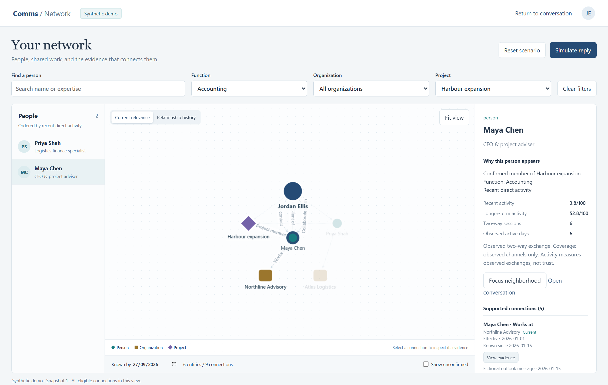
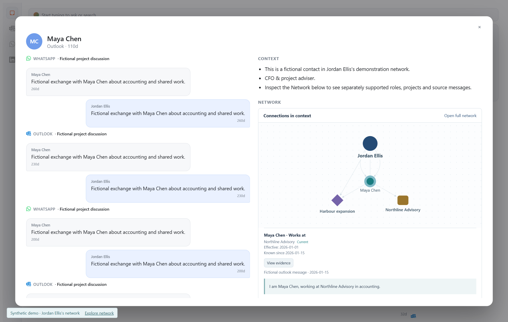

## Abstract

Personal business assistants need to retrieve people through changing roles, shared projects and communication history. A contact summary can describe one person while failing to preserve the identities, evidence and temporal meaning needed to connect that person to a wider network. This paper presents a system design and executable prototype that separates canonical identity, source episodes, reviewed relationship assertions, interaction history and task-specific retrieval. One graph projection supports both a network explorer and a compact slice embedded in an existing conversation interface. The implementation distinguishes effective time from observation time, permits concurrent roles, and separates recent activity from longer-term interaction evidence. A deterministic synthetic scenario contains 24 contacts, one explicit network owner, three organizations and two projects. Seven constructed retrieval cases and integrity checks demonstrate implemented behavior, including late-arriving employment information and same-name people. The temporal/context policy returns the expected contact set in seven cases, compared with three for deliberately limited contact-card baselines. These diagnostic results do not establish retrieval superiority or industrial usefulness. Graphiti and Hindsight inform the architecture; neither is claimed as an executed backend. The prototype provides a reproducible basis for supervisor feedback and a subsequent evaluation using independently selected business tasks.

**Keywords:** personal agents; temporal knowledge graphs; provenance; contact retrieval; human-centered AI.

## 1. Problem and research question

A business contact can simultaneously be a client, collaborator and adviser. An old collaborator may remain relevant to a project despite months without direct communication. A recently active sender may have little reciprocal history. An assistant that collapses these distinctions into a single relationship label or score can give an apparently clear but misleading account of a person's relevance.

The motivating application ingests communication from Outlook, WhatsApp and LinkedIn and resolves channel identities into people. Its existing conversation interface contains a per-contact network illustration derived from a cached summary. That illustration does not itself establish a shared, evidence-addressable network. The practical requirement is to build a broader explorer and derive the embedded contact view from the same model.

We ask: **Can an ego-centric representation that separates reviewed temporal assertions, interaction history and task relevance support more correct and explainable contact retrieval than simpler representations?** Here, correctness concerns stated source support and temporal consistency; usefulness requires later human evaluation. The current work contributes a concrete representation, a working two-view prototype and a reproducible diagnostic scenario suite. It does not introduce a new graph database or claim a validated measure of trust.

<div class="page-break"></div>

## 2. Research foundations and adoption choices

**Temporal graph memory.** Zep's published architecture describes temporal knowledge-graph memory for agents [1]. The current Graphiti implementation offers incremental episode ingestion, entity/fact extraction and hybrid retrieval, with custom entity and relationship types [2]. Its edge schema includes source episode references and distinct creation, expiration and validity fields. These capabilities make Graphiti a strong candidate for the extraction and retrieval layer. They do not establish that automatic deduplication will respect this application's canonical identities or reversible merges. In particular, the documented triple insertion path attempts deduplication even when callers supply nodes explicitly [3]. Hosted Zep and the open-source Graphiti library are distinct adoption choices; their capabilities and operational claims should not be conflated.

**Memory lifecycle and retrieval.** Hindsight organizes agent memory around retaining, recalling and reflecting [4]. Its implementation combines semantic, lexical, graph and temporal retrieval, with result fusion and a bounded context [5]. It uses PostgreSQL as its primary storage backend. This is relevant to the application's existing database stack, but a memory-fact graph is not automatically a canonical graph of people, reviewed roles and organizations. Its separation of source information from derived observations is a useful principle for future person models.

**Corpus-level graph retrieval.** Microsoft GraphRAG constructs entity/relationship artifacts and community reports to support local and global questions [6]. It supports incremental updates and importing an existing graph [7], so it should not be described as requiring complete rebuilding for every addition. Its main strengths concern corpus synthesis. The current official repository states that it is largely in maintenance mode and that the implementation is research demonstration code. It is therefore considered a possible analytical view, rather than the default authority for reviewed identity and relationship changes.

**Associative memory and activation.** A-MEM constructs and evolves linked memory notes [8]. Generative Agents combines memory retrieval, reflection and planning, with retrieval influenced by recency, importance and relevance [9]. These studies motivate bounded, context-sensitive retrieval. Their memory units and evaluation tasks differ from business-contact selection. In particular, the recency term in Generative Agents concerns time since memory retrieval in the simulation; copying its coefficient into communication-based relationship decay would change its meaning.

**Evidence boundary.** TAPE is listed as an ICDE 2026 demonstration paper on temporal graph memory for personal agents [10]. Its complete implementation was not inspected in this work, so no detailed engineering comparison is asserted. The earlier concept draft drew conceptual motivation from social cognition. The present prototype does not test a cognitive or neurological mechanism; the six-layer model below is an engineering decomposition.

The adoption decision remains provisional: evaluate Graphiti for temporal extraction and graph retrieval, or Hindsight if general conversational memory becomes the dominant requirement. Neither replaces the application's identity and review authority by default. The demonstrator deliberately provides a deterministic baseline against which such an integration can later be tested.

<div class="page-break"></div>

## 3. Representation and temporal semantics

The design retains six conceptual responsibilities from the initial concept paper while making their implementation status explicit.

| Responsibility | Representation | Prototype status |
|---|---|---|
| Identity | Stable typed person IDs; separate channel bindings in the existing application | Fictional canonical IDs; same-name distinction |
| Episodes | Source records with timestamps and provenance | Fictional messages and evidence excerpts |
| Person models | Versioned hypotheses about expertise or recurring preferences | Structured fixture roles only; inference deferred |
| Relationships | Separately reviewed assertions with multiple predicates | Implemented, including parallel roles |
| Context | Organizations and projects connecting people | Implemented explicit memberships |
| Activation | Task eligibility and time-dependent retrieval | Deterministic filters and two activity views |

The owner is a first-class person, denoted *u*. A selected contact *p* is a focus, not a new owner. Opening a slice around *p* must not redefine whose network is being described. A relationship assertion contains an ID, subject, predicate, object, scope, review status, origin, evidence references, observation time and optional validity interval. World assertions, such as employment, are distinguished from owner-relative assertions, such as collaboration with *u*. Missing dates remain unknown.

**Observation versus effectiveness.** Consider a September message stating that Alex joined Atlas in August and left a previous employee role in July. An August knowledge snapshot must not use the September message. A current view may show the new employment and a continuing advisory role at the former organization. The former employee role remains available in history. Ending a role requires supporting correction evidence; it does not follow merely from finding a second employer. The prototype's Known by control represents a knowledge snapshot, not a general-purpose interface for independently varying two time axes.

**Review status and provenance.** Confirmed and pending assertions are not interchangeable. Pending assertions require an explicit unconfirmed layer; rejected assertions are excluded. A source pointer establishes traceability, not truth. A user still needs to judge whether the source supports the assertion and whether the statement describes reality accurately. The demo's evidence is authored, not extracted, and is labeled fictional throughout.

**History is not trust.** Eligible direct messages are deduplicated and grouped into conversation sessions within each person/channel when adjacent messages are at most 30 minutes apart. For age *a* in days and half-life *h*, a session contributes `2^(-a/h)`. Summed contributions are displayed using `100 × (1 − exp(−sum/4))`, with illustrative half-lives of 30 and 180 days. These are engineering defaults, not learned or psychologically validated parameters. The interface separately reports reciprocal sessions, active days and channel coverage. Frequent one-way inbound can increase observed activity but does not imply a strong or trusted relationship.

<div class="page-break"></div>

## 4. Architecture and interaction contract

The proposed production architecture keeps raw communication, canonical identity, review decisions and merge history authoritative in the existing store. Temporal graph extraction and retrieval are replaceable derived services. This boundary lets the application correct an identity or reject a claim without treating a generated graph as unquestionable truth.

```text
Communication sources and structured records
                    |
Authoritative identity, evidence and review store
                    |
Temporal projection / candidate graph engine
                    |
Task filters + activity ordering + bounded subgraph
                    |
         Shared graph and evidence contract
             /                     \
    Full Network Explorer     Inbox contact slice
```

The executable prototype uses an isolated Flask service, synthetic fixtures and a pure Python projection in place of live ingestion and extraction. It does not import the production connector/monitor application. A single endpoint returns typed nodes, assertion edges, ranked contacts, evidence IDs, snapshot version, bounds and omission counts. Both visual hosts consume this contract. A locally bundled Cytoscape.js renderer provides graph interaction [11]; it is a visualization library, not the temporal reasoning backend.

**Bounded exploration.** The full view supports name/expertise search and function, organization and project filters. Its hard display limits are 50 nodes and 100 edges. The compact view defaults to at most eight nodes and 12 edges around the selected contact, with expansion limited to two hops. Omitted counts expose truncation. Membership is represented through context nodes, rather than adding a speculative person-to-person edge for every shared organization. These bounds control display complexity; they are not evidence of large-scale storage performance.

**Consistency across hosts.** Opening the full explorer from the Inbox carries the focused identity, filters and observation time. Returning restores the conversation context. The graph displays short relationship labels while the inspector holds full assertions, status, dates and evidence. Stable IDs prevent two people with identical names from being conflated by navigation. Selection and conversation opening are separate actions.

**Updates and uncertainty.** Scenario actions advance a version and emit server-sent notifications. Clients fetch complete snapshots and refresh after reconnect, including their evidence inspector. Request cancellation and generation checks protect against stale query responses. The current server is an in-memory local demonstrator; durable outbox/revision storage, production extraction freshness and cross-service correction propagation remain deployment work.

For a future Graphiti adapter, the adoption gates are canonical-ID control, separation of candidate and accepted claims, temporal evidence fidelity, and correct handling of corrections and identity undo. A prerequisite check found no installed Graphiti package or dedicated probe store in this environment. No extraction trial or Graphiti performance measurement is reported.

<div class="page-break"></div>

## 5. Executable prototype and demonstration

The shareable fixture contains 30 entities: 24 contacts, the owner, three organizations and two projects. It includes people with the same name, a contact with both client and collaborator roles, late-arriving employment evidence, a continuing advisory role, an unconfirmed introduction and a frequent one-way sender. Human-authored functions and memberships provide a controlled input. They should not be confused with demonstrated extraction quality.



The demonstration begins inside the existing conversation layout. A viewer inspects a contact's neighborhood, expands it into the full explorer, filters Accounting and Harbour expansion, and compares an older collaborator with a recently active specialist. A second sequence changes the Known by date to reveal the difference between when an employment change occurred and when the system learned it. Simulate reply changes the activity ranking; Reset scenario restores initial content while advancing the revision.

<div class="page-break"></div>

## 5.1 Embedded contact view

The compact host preserves the existing conversation layout: source messages remain on the left, with contact context and the shared network component on the right. The selected contact is emphasized without redefining the network owner. Multiple relationships between the same two people remain inspectable as separate assertions. The component exposes a bounded neighborhood and an explicit route to the full explorer, rather than squeezing the whole network into the available panel.



Browser acceptance exercises the actual rendered hosts, including the slice/explorer round trip, filtering, evidence retrieval and scenario updates. Source and API checks verify temporal eligibility, review status, evidence references and view bounds. Browser checks establish that these paths execute in the tested local environment; they do not establish that the design is usable for Mark or other operators. A five-minute presenter script accompanies the runnable code.

The initial integration remains opt-in for the fixture-backed server. The existing production contact-summary graph is not silently replaced with fictional data. This allows a business stakeholder to assess the interaction before committing to extraction infrastructure or exposing real communication in a demonstration.

<div class="page-break"></div>

## 6. Diagnostic evaluation and limitations

**Method.** Seven hand-authored cases specify expected contact IDs independently of the projection output. They cover project-specific accountants, research partners, current employment, historical employment, late-arriving evidence, same-name people and absent expertise. We compare three executed deterministic policies on the same fixture. Filter-only uses contact-card functions, names and current organization metadata. Filter-plus-recency adds latest eligible message ordering. Temporal/context retrieval uses eligible typed assertions, project context and the prototype's activity ordering. The first two intentionally lack project and employment-history relations. This is an ablation of represented information, not a comparison against strong graph or language-model retrieval systems.

| Policy | Exact expected contact sets | Cases |
|---|---:|---:|
| Contact-card filters | 3 | 7 |
| Contact-card filters + recency ordering | 3 | 7 |
| Typed temporal/context retrieval | 7 | 7 |

**Observed results.** The temporal/context policy returns the expected set in all seven diagnostic cases. Both limited baselines succeed in three. Their recency ordering does not change set membership, so equal set accuracy is expected; this metric cannot establish whether their ordering is useful. Current snapshots contain zero dangling evidence references and zero pending/rejected assertions in the default confirmed layer. Client and collaborator assertions remain separately represented. These outcomes are regenerated by the included evaluation script and stored as JSON/CSV, rather than manually entered estimates.

**What the results support.** The implementation can express and execute the specified distinctions on these fixtures. It can produce mutually consistent graph views and traceable assertion records. The results do not show that an LLM will extract the right roles or dates, that a graph improves general retrieval, or that activity scores predict valuable relationships. The cases were selected to expose features the proposed representation explicitly supports; the resulting advantage is therefore expected and potentially optimistic.

**Limitations.** The data is small, synthetic and authored by the system designer. There is no held-out distribution, independent annotator, human study, industrial task outcome, latency study or token-cost benchmark. Structured functions lack a fully versioned person-model lifecycle. Canonical IDs are demonstrated, but production identity merge/undo propagation has not been integrated. The time control combines observation-time eligibility with the state appropriate to that snapshot; independent retrospective valid-time querying remains future work. Graphiti/Hindsight extraction, vector retrieval and durable synchronization have not been executed. Missing channels can make interaction history incomplete.

**Next study.** Select Mark's business questions before tuning the representation. Compare vector, temporal and graph retrieval under a common corpus and context budget. Measure contact recall, ranking usefulness, role/time correctness, evidence support, latency and cost. Include cases requiring abstention and, where feasible, independent assessment of excerpts without the system label. Supervisor feedback should refine the study and the proposed publication contribution.

**Conclusion.** The prototype makes an ego-centric, evidence-backed temporal relationship design concrete in two connected interfaces. Its current value is an inspectable research artifact and business discussion tool. Establishing industrial usefulness and comparative retrieval performance is the next empirical step.

<div class="page-break"></div>

## References

1. *Zep: A Temporal Knowledge Graph Architecture for Agent Memory*. 2025. [arXiv:2501.13956](https://arxiv.org/abs/2501.13956).
2. Zep. *Graphiti: Build Real-Time Knowledge Graphs for AI Agents*. Official implementation and schema; accessed 27 September 2026. [Repository](https://github.com/getzep/graphiti); [edge implementation](https://github.com/getzep/graphiti/blob/main/graphiti_core/edges.py).
3. Zep. *Adding Fact Triples*. Official Graphiti documentation; accessed 27 September 2026. [Documentation](https://help.getzep.com/graphiti/working-with-data/adding-fact-triples).
4. *Hindsight is 20/20: Building Agent Memory that Retains, Recalls, and Reflects*. 2025. [arXiv:2512.12818](https://arxiv.org/abs/2512.12818).
5. Vectorize. *Hindsight: Recall and Storage*. Official architecture documentation; accessed 27 September 2026. [Recall](https://hindsight.vectorize.io/developer/retrieval); [storage](https://hindsight.vectorize.io/developer/storage).
6. *From Local to Global: A Graph RAG Approach to Query-Focused Summarization*. 2024. [arXiv:2404.16130](https://arxiv.org/abs/2404.16130).
7. Microsoft. *GraphRAG: CLI, Bring Your Own Graph, and Project Status*. Official documentation and README; accessed 27 September 2026. [CLI](https://microsoft.github.io/graphrag/cli/); [BYOG](https://microsoft.github.io/graphrag/index/byog/); [README](https://github.com/microsoft/graphrag).
8. *A-MEM: Agentic Memory for LLM Agents*. 2025. [arXiv:2502.12110](https://arxiv.org/abs/2502.12110).
9. *Generative Agents: Interactive Simulacra of Human Behavior*. 2023. [arXiv:2304.03442](https://arxiv.org/abs/2304.03442).
10. ICDE 2026. *Accepted Demo Papers*: TAPE: A Temporal Graph-based Memory System for Personal LLM Agents. [Conference listing](https://icde2026.github.io/demo-papers.html). Full implementation not verified in this work.
11. Cytoscape.js. *Graph theory library for visualization and analysis*. Official API documentation; version 3.34.3 bundled in the prototype. [Documentation](https://js.cytoscape.org/).

## Reproducibility and status

Run `python -m scripts.network_demo --port 5055` from the implementation checkout. The evaluation is reproduced with `python -m scripts.evaluate_network_demo`. Source fixtures, expected cases, results and the presentation script accompany the paper. The PDF is generated from this editable Markdown source by `python -m scripts.build_network_paper` using Pandoc and headless Microsoft Edge. Network illustrations are screenshots of the executable synthetic prototype.

This is a supervisor discussion draft, not a submitted or peer-reviewed publication. The baseline comparison is intentionally narrow. No private message content or real business-contact records are included. An editable bibliography is provided for subsequent venue-specific formatting.
